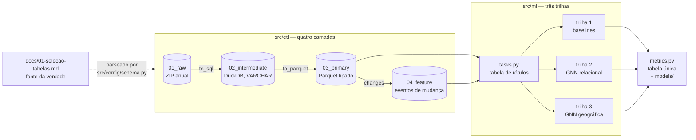

# CNES · Estrutura de rede e aquisição de recursos


Pipeline de dados e de modelagem sobre os microdados do CNES (Cadastro Nacional de
Estabelecimentos de Saúde, DATASUS). Prediz aquisição de equipamento médico entre
competências anuais, comparando três representações do mesmo rótulo: sem estrutura,
estrutura relacional e estrutura geográfica.

**Este README é a documentação técnica**: stack, arquitetura, camadas de dados e como
executar cada etapa. A discussão científica — pergunta de pesquisa, metodologia,
decisões e o artigo — está inteiramente em [`docs/`](docs/).

---

## Índice

- [Começar](#começar)
- [Stack](#stack)
- [Arquitetura](#arquitetura)
- [Camadas de dados](#camadas-de-dados)
- [Os dois pipelines](#os-dois-pipelines)
- [Executando: máquina pessoal](#executando-máquina-pessoal)
- [Executando: cluster](#executando-cluster)
- [Estrutura do repositório](#estrutura-do-repositório)
- [Testes](#testes)
- [Documentação](#documentação)

---

## Começar

```bash
git clone <repo> && cd IC
make setup          # cria .venv com uv, instala o pacote e as extensões do PyG
make testes         # confirma que o ambiente está de pé
make                # lista todos os alvos, com as variáveis e exemplos
```

`make` sem argumento é o índice do projeto. Todo comando documentado abaixo tem um
alvo correspondente.

**Requisitos.** Python 3.12 exato (`requires-python = "==3.12.*"`), gerenciado por
[uv](https://docs.astral.sh/uv/). Não há `pip` dentro do `.venv`; use
`VIRTUAL_ENV=.venv uv pip ...`.

`pyg-lib`, `torch-scatter` e `torch-sparse` não existem no PyPI e precisam do índice
de wheels casado com a versão do torch. `make setup` cuida disso; as instruções
manuais estão no cabeçalho de `requirements.txt`.

---

## Stack

| Camada | Ferramenta | Papel |
|---|---|---|
| Ingestão | `requests`, `zipfile` | baixa os ZIP anuais do DATASUS |
| Staging | **DuckDB** | lê CSV `ISO-8859-1` com `;`, tudo `VARCHAR` |
| Armazenamento | **Parquet** + **PyArrow** | camada tipada, particionada por competência |
| Grafo | **RelBench 2.1.1** + **PyTorch Geometric** | `Database` a partir do schema, `HeteroData` |
| Modelos | **PyTorch**, **scikit-learn** | GNNs e baselines tabulares (`HistGradientBoosting`) |
| Métricas | `scikit-learn`, `scipy` | AP, AUC por Mann-Whitney, MAP@k próprio |
| Testes | **pytest** | schema, partição, métricas, ETL e `hpc/` sintético |
| Orquestração | **Make** | ver `make` |

---

## Arquitetura



Três invariantes sustentam o desenho:

1. **O schema não vive no código.** [`docs/01-selecao-tabelas.md`](docs/01-selecao-tabelas.md)
   é a fonte única da verdade, e [`src/config/schema.py`](src/config/schema.py) o
   parseia no import. Editar o Markdown muda o pipeline. Não há segunda lista para
   manter em sincronia.
2. **As três trilhas consomem a mesma tarefa e a mesma partição.** É isso que torna
   os números comparáveis, e é a razão de `splits.py` e `tasks.py` serem módulos
   próprios em vez de código inline no notebook.
3. **A dependência só aponta para o contrato.** `config` não importa dos outros;
   `etl` não importa de `ml`.

### Unidade de análise: a transição

Uma competência do CNES é um **snapshot de estado atual**, não um log de eventos, e
guarda apenas o último `dt_atualizacao` por linha. A coluna de data é, portanto,
censurada à direita: usá-la como `time_col` daria a cada linha um instante que
depende de quando o snapshot foi tirado.

Por isso a unidade é a **transição** `t → t+1`, e o `time_col` do grafo é a data do
snapshot (1º de janeiro da competência), que é exata e uniforme. Eventos fornecem
rótulos; snapshots fornecem estado. Detalhe em `docs/03-decisoes.md`, D-08.

---

## Camadas de dados

```
data/01_raw/BASE_DE_DADOS_CNES_{YYYYMM}.ZIP         ~3,6 GB, 10 competências
data/02_intermediate/sql_cnes_{YYYYMM}.duckdb       descartável, ~4 GB cada
data/03_primary/{YYYYMM}/{tabela}.parquet           44 tabelas por competência
data/04_feature/changes/{tabela}/{periodo}.parquet  eventos de mudança
```

Nada sob `data/` é versionado — tudo é reprodutível a partir da camada 1.

A competência é sempre a string de 6 caracteres `YYYYMM` e é a chave de partição em
toda parte. A série canônica é janeiro de cada ano, 2017 a 2026: dez snapshots, nove
transições. `ANO_FINAL` em [`src/etl/extract.py`](src/etl/extract.py) é o único lugar
onde um novo janeiro é acrescentado.

### Armadilhas de formato

- **Nomes de CSV.** Dentro do ZIP são `{Tabela}{YYYYMM}.csv`. `to_sql.py` tira os 6
  caracteres para casar com `FACT_TABLES`, mas cria a tabela DuckDB com o nome
  **sufixado**; `to_parquet.py` tira de novo. Mudar a largura da competência quebra
  os dois.
- **Tudo é VARCHAR na camada intermediária.** A tipagem acontece só em
  `to_parquet`, guiada por `CNES_DTYPES`.
- **`CHAR(n)` do Oracle chega com espaço à direita**, e o preenchimento muda quando o
  CNES alarga uma coluna. Por isso colunas de texto passam por `NULLIF(TRIM(...), '')`
  — sem isso, toda comparação entre snapshots quebra em silêncio (D-30).
- **Três grafias para a mesma coisa.** Dicionário Oracle (`RL_ESTAB_COMPLEMENTAR`),
  CSV/DuckDB (`rlEstabComplementar`), e colunas de data embrulhadas no SQL da
  extração (`to_chardt_atualizacaoddmmyyyy`).

---

## Os dois pipelines

Isolados de propósito: uma mudança feita para o servidor não pode quebrar a execução
local (D-34).

| | `src/` | `hpc/` |
|---|---|---|
| Máquina | pessoal, 9 GB, sem GPU | `brucutuvii`: 440 GB, 2× RTX A6000 |
| Escopo típico | estado de São Paulo | país |
| Raiz de dados | `data/` no repositório | `$IC_HPC_DATA`, fora do repositório |
| Grafo | um, estático, cortado antes de todos os rótulos | um por transição |
| Projeção | mínima, 2 colunas por tabela filha | completa, com peso de aresta |
| Negativos de treino | 200:1 | todos |
| Convolução | `SAGEConv` | `GraphConv`, que aceita peso |

`hpc` importa de `src` só o que precisa ser idêntico para a comparação valer:
`config.schema`, `ml.metrics`, `ml.splits`, `ml.artefatos`, `ml.baselines`.
**Nenhum módulo de `src` importa de `hpc`.**

`--modo compativel | completo` é **condição experimental**, não compatibilidade de
código: o modo compatível replica as limitações de 9 GB em qualquer escopo, o que é o
que torna decomponível a matriz técnica × escopo.

---

## Executando: máquina pessoal

```bash
make etl                              # ETL completo, retomável, horas
make etl-periodo PERIODOS=202601      # só uma competência
make mudancas                         # recalcula eventos de mudança

make experimento                      # três trilhas no estado (~55 min, 6,3 GB)
make experimento-capital              # o mesmo na capital, barato
make experimento-baselines            # só a trilha 1
make experimento SEM_PANDEMIA=1       # controle sem 2020/2021

make resultados                       # tabela pareada do resultado mais recente
make modelos                          # lista os pacotes em models/
make validar RUN=models/<pacote>      # recomputa métricas sem GPU e sem data/
```

**Memória é restrição dura.** A máquina de referência tem 9 GB e montar a tabela de
tarefa uma vez já derrubou o IDE do autor. O alvo `experimento` embrulha a execução
num cgroup (`systemd-run --user --scope -p MemoryMax=$(MEM)`), então um estouro mata o
experimento e não a sessão. Ajuste com `MEM=`.

---

## Executando: cluster

Passo a passo completo em [`hpc/README.md`](hpc/README.md). Resumo:

```bash
export IC_HPC_DATA=/var/fasttmp/$USER/ic   # fora do repositório, obrigatoriamente
make hpc-ambiente                          # confere RAM, GPUs, VRAM, CUDA

screen -S etl
make hpc-etl                               # ETL nacional, paralelo por competência

screen -S bateria
make hpc-plano                             # o que vai rodar, sem rodar
make hpc-tudo                              # a bateria completa
```

`make hpc-tudo` roda **os dois pipelines** (`src` e `hpc`) sobre **três escopos**
(capital, estado, país) nas **duas variantes** (com e sem as transições de pandemia)
— 18 execuções. Cada uma é um subprocesso independente, então a bateria é retomável:
relançar pula o que já tem resultado em `docs/resultados/`.

```bash
make hpc-tudo SEMENTES=3    # repete cada célula, medindo a banda de ruído
make hpc-tudo SO=hpc        # só o pipeline do servidor
```

Repetição por semente não é luxo: duas execuções idênticas do mesmo código sobre os
mesmos dados já divergiram 15% em AP de baseline. Sem banda medida, diferença entre
células não é interpretável.

**Três guardas**, cada uma vinda de um problema concreto: a raiz de dados recusa
qualquer caminho dentro do repositório; o pipeline recusa rodar sem CUDA; e recusa
abaixo de 64 GB de RAM. Para exercitar a lógica de `hpc/` fora do servidor use os
testes sintéticos, nunca a camada primária real:

```bash
pytest tests/test_hpc_*.py -q
```

O cluster não tem escalonador e mata processo acima de 168 h — rode sob `screen`. O
ETL pula competência já convertida e o treino grava checkpoint por época.

---

## Estrutura do repositório

```
src/
  config/    paths.py, schema.py          contrato; não importa dos outros
  etl/       extract, to_sql, to_parquet, changes, pipeline
  ml/        splits, tasks, baselines, graph, gnn, metrics, artefatos
hpc/
  config/    paths.py, ambiente.py        raiz própria e guardas de máquina
  etl/       pipeline.py, grafo_store.py  ETL paralelo, camada 05 de grafos
  ml/        tarefa, grafo_temporal, treino, experimento
  roda_tudo.py                            driver da bateria completa
tools/       roda_experimento.py          orquestrador local das três trilhas
notebook/    00 a 04                      exploração e gates de decisão
tests/       pytest                       inclui hpc sintético
docs/        01 a 06 + resultados/        o contrato científico
models/      um diretório por execução    pesos, manifesto, escore por exemplo
```

Cada `__init__.py` carrega o mapa dos seus módulos e a regra que obedece.

### Artefatos de execução

Toda execução escreve um pacote em `models/`: `state_dict` em CPU, manifesto com
procedência e perfil da máquina, índice de nós e itens, curva de treino e **escore
por exemplo**. `make validar RUN=<dir>` recomputa AP, AUC e MAP@10 a partir do escore
salvo, sem GPU e sem `data/`, e confere contra o manifesto — é o que torna verificável
um número produzido no cluster.

O índice não é opcional: o embedding de item é indexado por posição, então pesos sem a
ordem de `unidades`/`itens` carregam sem erro e pontuam lixo. `salvar_execucao` recusa.

---

## Testes

```bash
make testes            # suíte completa
make teste-schema      # só o invariante central do schema
make verificar         # testes + resumo do schema derivado do doc
```

Os testes de `hpc/` usam dado sintético e rodam em qualquer máquina. Os demais não
dependem de `data/` estar populado.

---

## Documentação

Seis documentos em [`docs/`](docs/) formam o contrato do projeto. O código é
downstream deles.

| Documento | Conteúdo |
|---|---|
| [01-selecao-tabelas.md](docs/01-selecao-tabelas.md) | **fonte da verdade do schema**; editar muda o pipeline |
| [02-metodologia.md](docs/02-metodologia.md) | pergunta, definição de escassez, amostra, as três trilhas, protocolo |
| [03-decisoes.md](docs/03-decisoes.md) | 44 decisões numeradas, com a evidência e o que foi rejeitado |
| [04-dados-externos.md](docs/04-dados-externos.md) | teste de admissão de seis itens para fonte fora do CNES |
| [05-esboco-artigo.md](docs/05-esboco-artigo.md) | o argumento do artigo, com manifesto de figuras |
| [06-pipeline-hpc.md](docs/06-pipeline-hpc.md) | o pipeline do servidor e a matriz técnica × escopo |

Os notebooks em [`notebook/`](notebook/) são exploração e pontos de decisão:
`00_analise_alvo` é o gate empírico que escolheu o alvo; `03_modelagem` roda as três
trilhas; `04_recorte_e_dados_externos` mede o efeito do recorte e o viés da trilha
geográfica.

`docs/DICIONARIO_DE_DADOS.pdf` é o dicionário do DATASUS (155 páginas). Ele descreve o
banco **Oracle**, não o CSV distribuído: a extração exporta um subconjunto das colunas
e renomeia algumas. Onde os dois discordam, o CSV vence. Leia com `pdftotext -layout`.

Quando algo no código parecer surpreendente, a razão costuma ser uma entrada `D-nn` de
`03-decisoes.md`.

---

**Pedro H. S. Prestes** · orientação: Alexandre C. B. Delbem e Eric K. Tokuda
